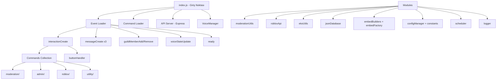
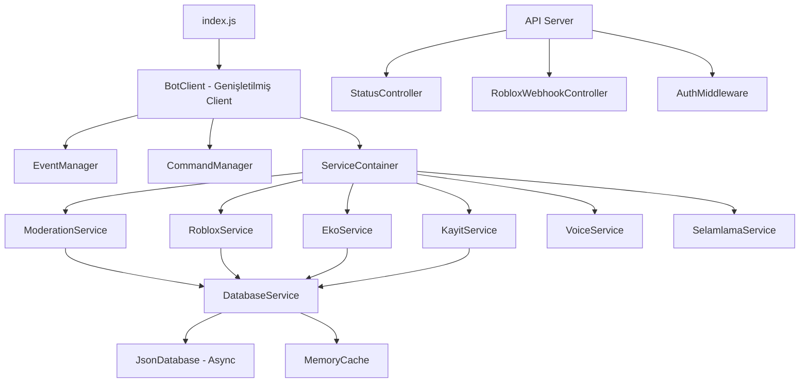
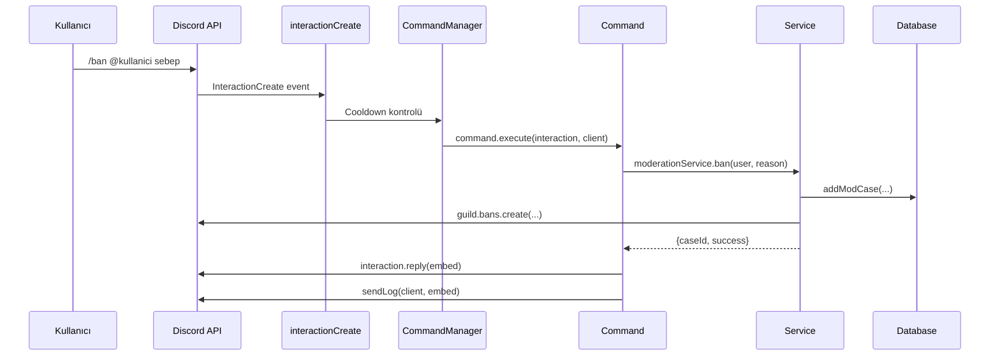
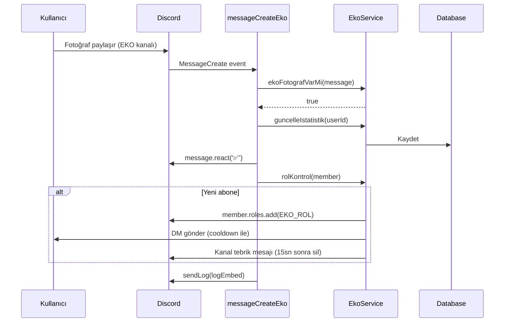

# Tasarım Belgesi: bem-1 Discord Botu — Sistem Geliştirme

## Overview

bem-1, Discord.js v14 tabanlı, Türkçe bir Discord sunucusu için geliştirilmiş çok katmanlı bir Discord botudur. Bot; moderasyon, Roblox entegrasyonu, ekonomi/abonelik otomasyonu, kayıt sistemi, ses yönetimi ve selamlama gibi birbirinden bağımsız ama birbirine bağlı sistemleri barındırmaktadır. Mevcut kod tabanı işlevsel olmakla birlikte; kod tekrarı, bellek sızıntısı riskleri, tutarsız hata yönetimi, dağınık sabit değerler ve test edilebilirlik eksiklikleri gibi yapısal sorunlar içermektedir. Bu tasarım belgesi, mevcut sistemleri bozmadan iyileştirmek için hem üst düzey mimari hem de alt düzey kod yapısı önerilerini kapsamaktadır.

## Mevcut Mimari Analizi

### Güçlü Yönler
- Komutlar, olaylar ve modüller net klasör yapısıyla ayrılmış
- `JsonDatabase` sınıfı ile kalıcı veri yönetimi mevcut
- `Scheduler` ile periyodik görev yönetimi var
- `EmbedFactory` ve `embedBuilders` ile embed oluşturma soyutlanmış
- `Logger` sınıfı ile renkli konsol çıktısı sağlanmış

### Tespit Edilen Sorunlar

**1. Kod Tekrarı**
- `selamlamaUtils.js` ve `utilities.js` içinde aynı desenler ve cevap havuzları çift tanımlanmış
- `ekoUtils.js` ve `embedBuilders.js` içinde aynı embed fonksiyonları (`ekoLogEmbed`, `ekoAboneDMEmbed`, `ekoKanalTebrikEmbed`) iki kez tanımlanmış
- `robloxApi.js` içinde `kayitGetirGrupRolleri` ve `getGroupRoles` neredeyse aynı işi yapıyor

**2. Bellek Yönetimi Riskleri**
- `ekoCooldownSet` (ekoUtils.js): `setTimeout` ile temizleniyor ama bot yeniden başlatılırsa temizlenmiyor
- `kayitCooldown` (messageCreateRegistration.js): Hiç temizlenmiyor, bellek sızıntısı riski var
- `pollVotes` (buttonHandler.js): Mesaj silinse bile Map'ten temizlenmiyor
- `selamlamaCooldown` (stats.js): Sınırsız büyüyebilir

**3. Hata Yönetimi Tutarsızlığı**
- Bazı komutlar `interaction.deferReply()` kullanıyor, bazıları kullanmıyor
- Hata mesajları kısmen İngilizce (`There was an error while executing this command!`)
- `interactionCreate.js` hata mesajı İngilizce
- `api.js` içinde kimlik doğrulama sadece tek bir sabit string ile yapılıyor (`'senturabem'`)

**4. Güvenlik Açıkları**
- `config.json` içinde `ROBLOX_API_KEY` açık metin olarak saklanmış (JWT token)
- API secret (`'senturabem'`) hardcoded
- `ROBLOX_COOKIE` ortam değişkeninden alınıyor ama fallback boş string

**5. Yapısal Sorunlar**
- `tempban.js` komutu kendi `JsonDatabase` örneği oluşturuyor, `moderationUtils.js` de ayrı bir örnek oluşturuyor — aynı dosyaya iki farklı yazıcı var
- `voiceStateUpdate.js` event handler neredeyse boş, gerçek mantık `VoiceManager`'da
- `stats.js` ve `utilities.js` içinde `hgIstatistik` ve `selamlamaCooldown` çift tanımlanmış
- `guildMemberAdd.js` içinde `stats` modülü dinamik `require` ile yükleniyor

**6. Eksik Özellikler**
- Uyarı eşiği aşıldığında otomatik ceza yok (örn. 3 uyarı = otomatik mute)
- Roblox API çağrılarında retry mekanizması yok
- `JsonDatabase` her yazma işleminde senkron `fs.writeFileSync` kullanıyor — yüksek yük altında performans sorunu
- Komut yükleme hatası sessizce geçiliyor, kritik komutlar yüklenemeyebilir

## Architecture

### Mevcut Mimari



### Önerilen Geliştirilmiş Mimari



### Veri Akışı — Komut İşleme



### Veri Akışı — Eko Yıldız Otomasyonu



## Components and Interfaces

### 1. DatabaseService — Geliştirilmiş JsonDatabase

**Mevcut Sorun:** Her `set()` çağrısında senkron `fs.writeFileSync` kullanılıyor. Yüksek frekanslı yazmalarda (eko fotoğraf, selamlama cooldown) bu bloklamaya yol açar.

**Önerilen Arayüz:**

```javascript
class JsonDatabase {
    constructor(fileName, options = {})
    // options: { writeDebounceMs: 500, autoSave: true }

    get(key)                    // Senkron okuma (bellekten)
    set(key, value)             // Senkron set + debounced yazma
    delete(key)                 // Senkron sil + debounced yazma
    all()                       // Tüm veriyi döndür
    async flush()               // Bekleyen yazmaları hemen uygula
    async save()                // Async dosya yazma
}
```

**İyileştirme Detayı:**

```javascript
// Mevcut (sorunlu):
set(key, value) {
    this.data[key] = value;
    fs.writeFileSync(this.filePath, JSON.stringify(this.data, null, 4)); // BLOKLAR
}

// Önerilen (debounced async):
set(key, value) {
    this.data[key] = value;
    this._scheduleWrite(); // Debounce: 500ms içinde birden fazla set varsa tek yazma
}

_scheduleWrite() {
    if (this._writeTimer) clearTimeout(this._writeTimer);
    this._writeTimer = setTimeout(() => this.save(), this.writeDebounceMs);
}

async save() {
    const tmp = this.filePath + '.tmp';
    await fs.promises.writeFile(tmp, JSON.stringify(this.data, null, 4));
    await fs.promises.rename(tmp, this.filePath); // Atomik yazma
}
```

**Sorumluluklar:**
- Bellek içi veri tutma (hızlı okuma)
- Debounced asenkron yazma (performans)
- Atomik dosya yazma (veri bütünlüğü)
- Başlangıçta otomatik yükleme

---

### 2. ModerationService — Birleşik Moderasyon Katmanı

**Mevcut Sorun:** `tempban.js` komutu kendi `JsonDatabase` örneği oluşturuyor (`new JsonDatabase('tempbans.json')`), `moderationUtils.js` de ayrı bir örnek oluşturuyor. Aynı dosyaya iki farklı yazıcı var — yarış koşulu riski.

**Önerilen Arayüz:**

```javascript
class ModerationService {
    // Tek örnek (singleton) — tüm komutlar bu servisi kullanır
    static getInstance()

    // Vaka yönetimi
    addCase(type, userId, moderatorId, reason)   // → caseId
    getCase(caseId)
    getCasesByUser(userId)

    // Uyarı sistemi
    addWarning(userId, reason, moderatorId)       // → warnCount
    getWarnings(userId)                           // → Warning[]
    removeWarning(userId, index)                  // → boolean
    checkAutoAction(userId, guild)                // Eşik kontrolü + otomatik ceza

    // Geçici cezalar
    addTempBan(userId, durationMs, reason, modId)
    addTempMute(userId, durationMs, reason, modId)
    removeTempBan(userId)
    removeTempMute(userId)
    checkExpired(client, config)                  // Scheduler tarafından çağrılır

    // Yardımcılar
    parseDuration(str)    // "10m" → 600000
    formatDuration(ms)    // 600000 → "10 dakika"
}
```

**Otomatik Ceza Eşiği (Yeni Özellik):**

```javascript
// Uyarı sayısına göre otomatik aksiyon
const UYARI_ESIKLERI = {
    3: { action: 'mute',    sure: '1h',  sebep: '3 uyarı eşiği aşıldı' },
    5: { action: 'tempban', sure: '24h', sebep: '5 uyarı eşiği aşıldı' },
    7: { action: 'ban',     sure: null,  sebep: '7 uyarı eşiği aşıldı' }
};

async checkAutoAction(userId, guild) {
    const warnCount = this.getWarnings(userId).length;
    const esik = UYARI_ESIKLERI[warnCount];
    if (!esik) return null;
    // Otomatik ceza uygula ve log'a kaydet
}
```

---

### 3. RobloxService — Birleşik Roblox API Katmanı

**Mevcut Sorun:** `robloxApi.js` içinde `getGroupRoles` ve `kayitGetirGrupRolleri` neredeyse aynı işi yapıyor. Cache yönetimi modül seviyesinde değişkenlerle yapılıyor.

**Önerilen Arayüz:**

```javascript
class RobloxService {
    constructor(cookie, groupId, kayitGroupId)

    // Kullanıcı işlemleri
    async getUser(username)           // → {id, name} | null
    async getUserById(userId)         // → RobloxUser | null
    async getUserRank(userId, groupId) // → {rank, name}
    async isInGroup(userId, groupId)  // → boolean

    // Grup işlemleri
    async getGroupRoles(groupId)      // Cache'li, TTL: 10dk
    async getRoleIdByRank(rank, groupId)
    async setRank(userId, rankNumber, groupId)
    async getMemberCount(groupId)

    // CSRF token (otomatik yenileme)
    async getCsrfToken()              // Cache'li, TTL: 5dk

    // Retry mekanizması (yeni)
    async _fetchWithRetry(url, options, maxRetries = 3)
}
```

**Retry Mekanizması (Yeni Özellik):**

```javascript
async _fetchWithRetry(url, options, maxRetries = 3) {
    for (let attempt = 1; attempt <= maxRetries; attempt++) {
        try {
            const res = await fetch(url, options);
            if (res.status === 429) { // Rate limit
                const retryAfter = parseInt(res.headers.get('retry-after') || '5') * 1000;
                await new Promise(r => setTimeout(r, retryAfter));
                continue;
            }
            return res;
        } catch (err) {
            if (attempt === maxRetries) throw err;
            await new Promise(r => setTimeout(r, 1000 * attempt)); // Exponential backoff
        }
    }
}
```

**Cache Yönetimi:**

```javascript
// Mevcut (modül seviyesi değişken — TTL yok):
let groupRolesCache = null;

// Önerilen (TTL'li cache):
class TTLCache {
    constructor(ttlMs) { this.ttlMs = ttlMs; this.store = new Map(); }
    get(key) {
        const entry = this.store.get(key);
        if (!entry) return null;
        if (Date.now() > entry.expiresAt) { this.store.delete(key); return null; }
        return entry.value;
    }
    set(key, value) {
        this.store.set(key, { value, expiresAt: Date.now() + this.ttlMs });
    }
}
```

### 4. EkoService — Eko Yıldız Sistemi

**Mevcut Sorun:** `ekoUtils.js` ve `embedBuilders.js` içinde aynı embed fonksiyonları çift tanımlanmış. `ekoCooldownSet` bellek içinde tutuluyor, bot yeniden başlatılınca sıfırlanıyor.

**Önerilen Arayüz:**

```javascript
class EkoService {
    constructor(database)

    // Fotoğraf kontrolü
    fotografVarMi(message)                    // → boolean (geliştirilmiş)

    // İstatistik
    guncelleIstatistik(userId)                // → {gunlukSayi, kullaniciFoto}
    getIstatistik(userId)                     // → UserStats
    getGunlukIstatistik()                     // → DailyStats

    // Cooldown (kalıcı)
    cooldownKontrol(userId)                   // → boolean (bugün DM gönderildi mi?)
    cooldownEkle(userId)                      // Bugünün tarihiyle kaydet

    // Embed oluşturma (tek yer)
    buildLogEmbed(member, yeniAbone, fotoSayi, dmDurumu)
    buildDMEmbed(member, toplamFoto)
    buildTebrikEmbed(member, toplamFoto, yeniAbone)
}
```

**Cooldown İyileştirmesi:**

```javascript
// Mevcut (bellek içi — bot restart'ta sıfırlanır):
const ekoCooldownSet = new Set();

// Önerilen (kalıcı — JsonDatabase ile):
cooldownKontrol(userId) {
    const bugun = new Date().toISOString().slice(0, 10);
    const kayit = this.db.get(`cooldown_${userId}`);
    return kayit === bugun;
}

cooldownEkle(userId) {
    const bugun = new Date().toISOString().slice(0, 10);
    this.db.set(`cooldown_${userId}`, bugun);
    // Ertesi gün otomatik geçersiz olur (tarih karşılaştırması)
}
```

**Fotoğraf Tespiti İyileştirmesi:**

```javascript
// Mevcut (utilities.js — sadece attachment ve embed kontrolü):
function ekoFotografVarMi(message) {
    return message.attachments.size > 0 || message.embeds.length > 0;
}

// Önerilen (ekoUtils.js — daha kapsamlı):
fotografVarMi(message) {
    const RESIM_UZANTILARI = new Set(['jpg','jpeg','png','gif','webp','bmp','tiff','avif','heic','heif']);
    // 1. Attachment uzantı kontrolü
    if (message.attachments.some(a => {
        const ext = (a.name || '').split('.').pop().toLowerCase();
        return RESIM_UZANTILARI.has(ext);
    })) return true;
    // 2. Content-type kontrolü
    if (message.attachments.some(a => a.contentType?.startsWith('image/'))) return true;
    // 3. Embed image/thumbnail kontrolü
    if (message.embeds.some(e => e.image || e.thumbnail)) return true;
    // 4. URL regex kontrolü
    const URL_REGEX = /https?:\/\/\S+\.(jpg|jpeg|png|gif|webp|bmp|svg)(\?[^\s]*)?/i;
    return URL_REGEX.test(message.content);
}
```

---

### 5. MemoryManager — Bellek Sızıntısı Önleme

**Mevcut Sorun:** Birden fazla `Map` ve `Set` sınırsız büyüyebilir.

**Önerilen Arayüz:**

```javascript
class BoundedMap extends Map {
    constructor(maxSize = 1000, ttlMs = null) {
        super();
        this.maxSize = maxSize;
        this.ttlMs = ttlMs;
        this.timestamps = ttlMs ? new Map() : null;
    }

    set(key, value) {
        // TTL kontrolü
        if (this.ttlMs) this.timestamps.set(key, Date.now());
        // Boyut sınırı — en eski girişi sil
        if (this.size >= this.maxSize) {
            const firstKey = this.keys().next().value;
            this.delete(firstKey);
        }
        return super.set(key, value);
    }

    get(key) {
        if (this.ttlMs) {
            const ts = this.timestamps?.get(key);
            if (ts && Date.now() - ts > this.ttlMs) {
                this.delete(key);
                return undefined;
            }
        }
        return super.get(key);
    }
}

// Kullanım:
const kayitCooldown = new BoundedMap(500, 30_000);    // Max 500 giriş, 30sn TTL
const selamlamaCooldown = new BoundedMap(1000, 6_000); // Max 1000 giriş, 6sn TTL
const pollVotes = new BoundedMap(200);                 // Max 200 anket
```

---

### 6. API Sunucusu — Güvenlik İyileştirmeleri

**Mevcut Sorun:** API secret hardcoded (`'senturabem'`), kimlik doğrulama tek bir middleware'de değil.

**Önerilen Yapı:**

```javascript
// Mevcut (güvensiz):
const secret = req.headers['x-nexus-secret'];
if (secret !== 'senturabem') return res.status(403).json({ error: 'Unauthorized' });

// Önerilen (ortam değişkeninden + middleware):
function authMiddleware(req, res, next) {
    const secret = req.headers['x-nexus-secret'];
    const expectedSecret = process.env.NEXUS_SECRET || config.NEXUS_SECRET;
    if (!expectedSecret || secret !== expectedSecret) {
        return res.status(403).json({ error: 'Unauthorized' });
    }
    next();
}

// Tüm korumalı route'lara uygula:
app.post('/api/oc-playerlist', authMiddleware, handlePlayerList);
app.post('/update-adalet', authMiddleware, handleUpdateAdalet);
```

---

### 7. InteractionCreate — Türkçe Hata Mesajları

**Mevcut Sorun:** Hata mesajları İngilizce.

```javascript
// Mevcut:
await interaction.followUp({ content: 'There was an error while executing this command!', flags: 64 });

// Önerilen:
const HATA_MESAJI = '❌ Komut çalıştırılırken bir hata oluştu. Lütfen tekrar deneyin.';
await interaction.followUp({ content: HATA_MESAJI, flags: 64 });
```

## Data Models

### ModCase (Moderasyon Vakası)

```javascript
// Mevcut:
{
    caseId: number,
    type: string,          // 'BAN', 'KICK', 'MUTE', 'WARN', 'TEMPBAN', 'TEMPMUTE'
    userId: string,
    moderatorId: string,
    reason: string,
    timestamp: string      // ISO string
}

// Önerilen (ek alanlar):
{
    caseId: number,
    type: 'BAN' | 'KICK' | 'MUTE' | 'WARN' | 'TEMPBAN' | 'TEMPMUTE' | 'UNBAN' | 'UNMUTE',
    userId: string,
    moderatorId: string,
    reason: string,
    timestamp: string,
    guildId: string,       // Çoklu sunucu desteği için
    expiresAt: number | null,  // Geçici cezalar için
    active: boolean        // Aktif mi? (unban/unmute ile false olur)
}
```

### Warning (Uyarı)

```javascript
// Mevcut:
[{ reason: string, moderatorId: string, timestamp: string }]

// Önerilen:
[{
    id: string,            // UUID — warnremove için güvenilir referans
    reason: string,
    moderatorId: string,
    timestamp: string,
    caseId: number         // İlgili mod vakasına referans
}]
```

### TempPunishment (Geçici Ceza)

```javascript
// Mevcut (tempbans.json):
{ [userId]: { expiresAt: number, reason: string, moderatorId: string } }

// Önerilen:
{ [userId]: {
    expiresAt: number,
    reason: string,
    moderatorId: string,
    caseId: number,
    guildId: string,
    type: 'tempban' | 'tempmute'
}}
```

### EkoStats (Eko Yıldız İstatistikleri)

```javascript
// Mevcut (bellek içi Map):
{ count: number, lastPhotoAt: Date, totalPhotos: number }

// Önerilen (kalıcı JsonDatabase):
{
    userId: string,
    totalPhotos: number,
    lastPhotoAt: string,   // ISO string
    subscribedAt: string,  // İlk abone olma tarihi
    dailyCooldown: string  // 'YYYY-MM-DD' formatında son DM tarihi
}
```

### RobloxServer (API Sunucu Verisi)

```javascript
// Mevcut:
{ placeId: string, players: string[], bans: string[], lastUpdate: number }

// Önerilen (ek alanlar):
{
    serverId: string,
    placeId: string,
    players: string[],
    bans: string[],
    lastUpdate: number,
    serverVersion: string | null,  // Oyun versiyonu
    maxPlayers: number | null
}
```

## Algoritmik Pseudocode

### Ana Komut İşleme Akışı

```pascal
ALGORITHM handleInteraction(interaction, client)
INPUT: interaction (Discord Interaction), client (Discord Client)
OUTPUT: void

BEGIN
    IF interaction.isChatInputCommand() THEN
        command ← client.commands.get(interaction.commandName)
        
        IF command = null THEN
            LOG error "Komut bulunamadı: " + interaction.commandName
            RETURN
        END IF
        
        // Cooldown kontrolü
        cooldownMs ← (command.cooldown ?? 3) * 1000
        lastUsed ← client.cooldowns.get(command.name)?.get(interaction.user.id)
        
        IF lastUsed ≠ null AND (now - lastUsed) < cooldownMs THEN
            remaining ← Math.ceil((cooldownMs - (now - lastUsed)) / 1000)
            REPLY ephemeral "⏳ Lütfen " + remaining + " saniye bekleyin."
            RETURN
        END IF
        
        SET cooldown for user
        
        TRY
            AWAIT command.execute(interaction, client)
        CATCH error
            LOG error
            IF interaction.replied OR interaction.deferred THEN
                FOLLOWUP ephemeral "❌ Komut çalıştırılırken hata oluştu."
            ELSE
                REPLY ephemeral "❌ Komut çalıştırılırken hata oluştu."
            END IF
        END TRY
        
    ELSE IF interaction.isButton() THEN
        AWAIT buttonHandler.handle(interaction, client)
    ELSE IF interaction.isAutocomplete() THEN
        AWAIT command.autocomplete(interaction)
    END IF
END
```

### Geçici Ceza Kontrol Algoritması

```pascal
ALGORITHM checkExpiredPunishments(client, config)
INPUT: client (Discord Client), config (Config Object)
OUTPUT: void (side effects: unban/unmute işlemleri)

PRECONDITION: client.isReady() = true

BEGIN
    now ← Date.now()
    
    // Geçici banlar
    FOR EACH (userId, data) IN tempbanDatabase.entries() DO
        IF now >= data.expiresAt THEN
            tempbanDatabase.delete(userId)
            
            FOR EACH guild IN client.guilds.cache DO
                TRY
                    AWAIT guild.bans.remove(userId, 'Geçici ban süresi doldu')
                    user ← AWAIT client.users.fetch(userId)
                    IF user ≠ null THEN
                        client.emit('moderation_log', { type: 'auto_unban', user, guild })
                    END IF
                CATCH
                    // Kullanıcı zaten unbanned olabilir, sessizce geç
                END TRY
            END FOR
        END IF
    END FOR
    
    // Geçici muteler
    FOR EACH (userId, data) IN tempmuteDatabase.entries() DO
        IF now >= data.expiresAt THEN
            tempmuteDatabase.delete(userId)
            
            FOR EACH guild IN client.guilds.cache DO
                TRY
                    member ← AWAIT guild.members.fetch(userId)
                    IF member = null THEN CONTINUE END IF
                    
                    muteRole ← guild.roles.cache.get(config.MUTE_ROLE_ID)
                    IF muteRole ≠ null AND member.roles.cache.has(muteRole.id) THEN
                        AWAIT member.roles.remove(muteRole, 'Geçici mute süresi doldu')
                        client.emit('moderation_log', { type: 'auto_unmute', member })
                    END IF
                CATCH
                    // Üye sunucudan ayrılmış olabilir
                END TRY
            END FOR
        END IF
    END FOR
END

POSTCONDITION: Süresi dolan tüm geçici cezalar kaldırılmış
LOOP INVARIANT: Her iterasyonda işlenen userId veritabanından silinmiş
```

### Roblox Rank Değiştirme Algoritması

```pascal
ALGORITHM setRobloxRank(userId, rankNumber, groupId)
INPUT: userId (number), rankNumber (number), groupId (number)
OUTPUT: boolean (başarı durumu)

PRECONDITION: ROBLOX_COOKIE ≠ null AND ROBLOX_COOKIE ≠ ''

BEGIN
    // 1. Role ID'yi bul (cache'li)
    roles ← AWAIT getGroupRoles(groupId)  // TTL cache
    role ← roles.find(r => r.rank = rankNumber)
    
    IF role = null THEN
        THROW Error("Rank " + rankNumber + " için role bulunamadı")
    END IF
    
    // 2. CSRF token al (cache'li, 5dk TTL)
    csrfToken ← AWAIT getCsrfToken()
    
    // 3. API çağrısı (retry ile)
    FOR attempt ← 1 TO 3 DO
        response ← AWAIT fetch(
            "https://groups.roblox.com/v1/groups/" + groupId + "/users/" + userId,
            { method: 'PATCH', body: { roleId: role.id }, headers: { csrfToken } }
        )
        
        IF response.status = 200 THEN
            RETURN true
        ELSE IF response.status = 429 THEN
            retryAfter ← response.headers['retry-after'] * 1000
            AWAIT sleep(retryAfter)
        ELSE IF response.status = 403 THEN
            // CSRF token geçersiz, yenile
            csrfToken ← AWAIT getCsrfToken(forceRefresh: true)
        ELSE
            THROW Error("Roblox API Hatası: " + response.status)
        END IF
    END FOR
    
    THROW Error("Maksimum deneme sayısına ulaşıldı")
END

POSTCONDITION: userId'nin groupId grubundaki rütbesi rankNumber olarak güncellendi
```

## Temel Fonksiyonlar ve Formal Spesifikasyonlar

### `JsonDatabase.set(key, value)`

**Preconditions:**
- `key` string türünde ve boş değil
- `value` JSON serileştirilebilir bir değer

**Postconditions:**
- `this.data[key] === value` (bellek içi)
- 500ms içinde dosyaya yazılır (debounced)
- Yazma atomik: ya tamamen yazılır ya da eski dosya korunur

**Loop Invariants:** Yok (döngü içermiyor)

---

### `ModerationService.checkAutoAction(userId, guild)`

**Preconditions:**
- `userId` geçerli bir Discord kullanıcı ID'si
- `guild` geçerli bir Discord Guild nesnesi
- `MUTE_ROLE_ID` config'de tanımlı

**Postconditions:**
- Uyarı sayısı eşiği aşıyorsa otomatik ceza uygulanır
- Uygulanan ceza mod log'a kaydedilir
- Eşik aşılmıyorsa hiçbir şey değişmez

---

### `RobloxService.getGroupRoles(groupId)`

**Preconditions:**
- `groupId` pozitif integer
- `ROBLOX_COOKIE` geçerli ve süresi dolmamış

**Postconditions:**
- Cache geçerliyse (TTL < 10dk) API çağrısı yapılmaz
- Cache geçersizse API'den alınır ve cache güncellenir
- Hata durumunda boş dizi döner (uygulama çökmez)

---

### `BoundedMap.set(key, value)`

**Preconditions:**
- `key` herhangi bir değer (Map key kuralları)
- `this.maxSize > 0`

**Postconditions:**
- `this.size <= this.maxSize` (boyut sınırı korunur)
- Boyut sınırı aşılırsa en eski giriş silinir (FIFO)
- TTL tanımlıysa timestamp kaydedilir

**Loop Invariants:** Yok

---

## Error Handling

### Hata Senaryosu 1: Discord API Hatası (Komut Çalıştırma)

**Koşul:** `command.execute()` bir exception fırlatır
**Yanıt:** Kullanıcıya Türkçe ephemeral hata mesajı gönderilir
**Kurtarma:** Hata loglanır, bot çalışmaya devam eder

```javascript
// interactionCreate.js içinde:
try {
    await command.execute(interaction, client);
} catch (error) {
    Logger.error(`Komut hatası [${interaction.commandName}]:`, error);
    const msg = '❌ Komut çalıştırılırken bir hata oluştu. Lütfen tekrar deneyin.';
    if (interaction.replied || interaction.deferred) {
        await interaction.followUp({ content: msg, flags: 64 }).catch(() => {});
    } else {
        await interaction.reply({ content: msg, flags: 64 }).catch(() => {});
    }
}
```

### Hata Senaryosu 2: Roblox API Erişilemez

**Koşul:** Roblox API'si 3 denemede de yanıt vermiyor
**Yanıt:** Kullanıcıya "Roblox API şu anda erişilemiyor" mesajı
**Kurtarma:** Hata loglanır, cache'deki son veri kullanılmaya devam eder

### Hata Senaryosu 3: JsonDatabase Yazma Hatası

**Koşul:** `fs.promises.writeFile` başarısız (disk dolu, izin hatası vb.)
**Yanıt:** Hata loglanır, bellek içi veri korunur
**Kurtarma:** Bir sonraki yazma denemesinde tekrar denenebilir

```javascript
async save() {
    try {
        const tmp = this.filePath + '.tmp';
        await fs.promises.writeFile(tmp, JSON.stringify(this.data, null, 4));
        await fs.promises.rename(tmp, this.filePath);
    } catch (err) {
        Logger.error(`[DB] ${this.filePath} yazılamadı:`, err);
        // Bellek içi veri korunur, uygulama çökmez
    }
}
```

### Hata Senaryosu 4: Bot Ses Kanalından Atılıyor

**Koşul:** `voiceStateUpdate` eventi botun kanaldan çıkarıldığını tespit eder
**Yanıt:** `VoiceManager.connect()` çağrılır
**Kurtarma:** Scheduler her 60 saniyede bağlantıyı kontrol eder

### Hata Senaryosu 5: Kayıt Karşılama Mesajı Siliniyor

**Koşul:** `messageDelete` eventi kayıt kanalındaki karşılama mesajının silindiğini tespit eder
**Yanıt:** 2 saniye bekleyip `kayitKarsilamaMesajiniGonder()` çağrılır
**Kurtarma:** Yeni mesaj gönderilir ve sabitlenir

## Testing Strategy

### Birim Test Yaklaşımı

Test edilmesi öncelikli modüller:

1. **`JsonDatabase`** — `set/get/delete/all` işlemleri, debounce davranışı, atomik yazma
2. **`ModerationService`** — `parseDuration`, `formatDuration`, `checkAutoAction` eşik mantığı
3. **`RobloxService`** — Cache TTL davranışı, retry mekanizması, hata durumları
4. **`BoundedMap`** — Boyut sınırı, TTL davranışı, FIFO silme
5. **`ekoFotografVarMi`** — Farklı attachment türleri, URL regex

### Özellik Tabanlı Test Yaklaşımı

**Test Kütüphanesi:** fast-check (Node.js için)

```javascript
// parseDuration özellik testi:
// ∀ geçerli süre string'i s: parseDuration(s) > 0
// ∀ geçersiz string s: parseDuration(s) = null

// BoundedMap özellik testi:
// ∀ n işlem sonrası: map.size <= maxSize
// ∀ TTL süresi geçmiş key: map.get(key) = undefined
```

### Entegrasyon Test Yaklaşımı

- Discord.js Client mock'u ile komut execute testleri
- Express API endpoint testleri (supertest)
- Roblox API mock'u ile rank değiştirme akışı

## Performans Değerlendirmeleri

### Mevcut Darboğazlar

| Bileşen | Sorun | Etki |
|---------|-------|------|
| `JsonDatabase.set()` | Senkron `writeFileSync` | Her yazma işleminde event loop bloklanır |
| `robloxApi.getGroupRoles()` | Cache TTL yok | Her komutta API çağrısı yapılabilir |
| `checkExpiredPunishments()` | Tüm guild'leri tarar | Çok sunuculu botlarda yavaş |
| `selamlamaCooldown` Map | Sınırsız büyüme | Uzun süre çalışmada bellek tükenir |

### Önerilen İyileştirmeler

- `JsonDatabase`: Debounced async yazma → event loop bloklanmaz
- `RobloxService`: TTL cache → gereksiz API çağrıları önlenir
- `BoundedMap`: Boyut sınırı → bellek tüketimi kontrol altında
- `checkExpiredPunishments`: Sadece aktif cezaları tutan index → O(n) yerine O(aktif_ceza)

## Güvenlik Değerlendirmeleri

### Mevcut Riskler

1. **`config.json` içinde JWT token** — `ROBLOX_API_KEY` açık metin olarak saklanmış
2. **Hardcoded API secret** — `'senturabem'` kaynak kodda görünür
3. **ROBLOX_COOKIE** — Ortam değişkeninden alınıyor ama fallback boş string (sessiz hata)

### Önerilen Düzeltmeler

```javascript
// config.json'dan kaldır, .env'e taşı:
// ROBLOX_API_KEY=...
// NEXUS_SECRET=...
// ROBLOX_COOKIE=...

// configManager.js içinde zorunlu değer kontrolü:
get(key, required = false) {
    const value = process.env[key.toUpperCase()] || this.config[key];
    if (required && !value) {
        throw new Error(`Zorunlu config değeri eksik: ${key}`);
    }
    return value || null;
}

// index.js başlangıcında:
const requiredKeys = ['TOKEN', 'CLIENT_ID', 'GUILD_ID', 'ROBLOX_COOKIE'];
for (const key of requiredKeys) {
    configManager.get(key, true); // Eksikse hemen hata fırlat
}
```

### Ek Güvenlik Önlemleri

- API rate limiting (express-rate-limit) ekle
- Roblox webhook endpoint'lerine IP whitelist ekle
- `config.json`'ı `.gitignore`'a ekle (şu an yok)

## Bağımlılıklar

### Mevcut Bağımlılıklar

| Paket | Versiyon | Kullanım |
|-------|----------|---------|
| discord.js | ^14.13.0 | Discord API istemcisi |
| express | ^4.18.2 | HTTP API sunucusu |
| @discordjs/voice | ^0.16.1 | Ses kanalı bağlantısı |
| @discordjs/opus | ^0.9.0 | Ses codec |
| libsodium-wrappers | ^0.7.13 | Ses şifreleme |
| chalk | ^4.1.2 | Renkli konsol çıktısı |

### Önerilen Ek Bağımlılıklar

| Paket | Versiyon | Kullanım |
|-------|----------|---------|
| dotenv | ^16.3.1 | `.env` dosyası desteği |
| express-rate-limit | ^7.1.5 | API rate limiting |

### Kaldırılabilecek Bağımlılıklar

- `@discordjs/opus` ve `libsodium-wrappers`: Sadece ses kanalına bağlanmak için kullanılıyor, `@discordjs/voice` ile gerçek ses oynatma yapılmıyorsa gereksiz

## Correctness Properties

### Property 1: Veri Bütünlüğü — JsonDatabase

`∀ key, value: db.set(key, value) → db.get(key) === value`

JsonDatabase'e yazılan her değer, aynı key ile okunduğunda aynı değeri döndürmelidir. Bu özellik hem bellek içi hem de dosyadan yeniden yükleme sonrasında geçerlidir.

### Property 2: BoundedMap Boyut Sınırı

`∀ n işlem (n > maxSize): boundedMap.size ≤ maxSize`

BoundedMap'e maxSize'dan fazla giriş eklendiğinde, en eski girişler FIFO sırasıyla silinir ve map boyutu hiçbir zaman maxSize'ı aşmaz.

### Property 3: Cooldown Doğruluğu

`∀ userId, komut: cooldown aktifken aynı kullanıcı aynı komutu çalıştıramaz`

Bir kullanıcı komut çalıştırdıktan sonra cooldown süresi dolmadan aynı komutu tekrar çalıştırmaya çalışırsa, komut execute edilmez ve kullanıcıya bekleme süresi bildirilir.

### Property 4: parseDuration Dönüşüm Doğruluğu

`∀ geçerli format s ∈ {Nd, Nh, Nm, Ns}: parseDuration(s) > 0`
`∀ geçersiz format s: parseDuration(s) = null`

Geçerli süre formatları (örn. "10m", "2h", "1d") pozitif milisaniye değeri döndürür. Geçersiz formatlar null döndürür.

### Property 5: Geçici Ceza Süresi Garantisi

`∀ tempban/tempmute: expiresAt geçtikten sonra ≤ 60sn içinde ceza kaldırılır`

Scheduler her 60 saniyede `checkExpiredPunishments` çalıştırdığından, süresi dolan her geçici ceza en geç 60 saniye içinde kaldırılır.

### Property 6: Eko Günlük DM Tekil Garantisi

`∀ userId, gün: aynı kullanıcıya aynı günde en fazla 1 DM gönderilir`

Eko cooldown sistemi, bir kullanıcıya aynı takvim günü içinde birden fazla DM gönderilmesini engeller.

### Property 7: Rütbe Sınırı Kontrolü

`∀ terfi işlemi: currentRankIndex < rankList.length - 1 → terfi mümkün`
`∀ terfi işlemi: currentRankIndex ≥ rankList.length - 1 → hata döner`

En üst rütbedeki bir kullanıcı terfi ettirilemez; sistem hata mesajı döndürür.

### Property 8: Hata İzolasyonu

`∀ komut hatası: diğer komutlar ve sistemler çalışmaya devam eder`

Herhangi bir komutun execute fonksiyonunda oluşan hata, try-catch ile yakalanır ve bot'un genel çalışmasını etkilemez.

